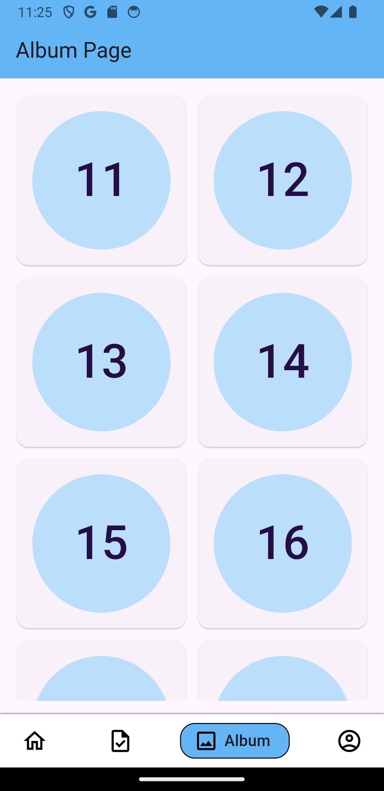

# Tech Jar Recruitment Task - Flutter Development

___

## Introduction

This Flutter development project for the Tech Jar recruitment task boasts a range of dynamic features. Users can explore an album showcasing the content of user 2, efficiently manage their to-do list with a seamless addition feature, and navigate through a user page displaying comprehensive details of all users in the database.

The homepage provides a centralized hub, displaying all posts. On clicking a post, users are seamlessly directed to a dedicated post page that not only showcases the selected post but also integrates the respective comments for a holistic user experience. As a key interactive feature, users have the ability to contribute by adding comments, fostering engagement and interactivity within the application.

The project incorporates advanced Flutter development techniques, effective API integration, and showcases the power of Riverpod for state management. With its user-centric design and comprehensive functionality, this project serves as a testament to the developer's proficiency in Flutter development and API interaction.

___

## Usage

### Installation

1. Make sure that you have flutter installed in the system.
2. Clone this repo: `git clone https://github.com/SulabhShrestha/techjar_task`
3. `cd Tech-Jar-Task`
4. `flutter pub get`

That's it. Now you can run this project.

### Key Features

1. **State Management with Riverpod**:
Utilize the powerful Riverpod library for effective and scalable state management in the Flutter application.

2. **API Integration**:
Seamlessly integrate with external APIs to fetch and display real-time data, ensuring dynamic and up-to-date content.

3. **Optimized Code**:
Implement code optimization techniques to enhance performance, maintainability, and overall code quality.

4. **MVVM + Services Architecture**:
Follow the Model-View-ViewModel (MVVM) architecture, supported by well-defined services, for a structured and maintainable codebase.

5. **View Post and Comment**:
Enable users to view posts and associated comments, providing a comprehensive and interactive experience.

6. **CRUD Todo Tasks**:
Implement Create, Read, Update, and Delete (CRUD) functionality for managing to-do tasks, offering users full control over their task lists.

7. **View Album and Photos**:
Allow users to explore and view albums, complete with a photo gallery, enhancing the multimedia experience within the application.

8. **View All Users**:
Provide a comprehensive list of all users, offering visibility into the user base and promoting community interaction.

### Technologies used

1. **Flutter**:
The project is built using the Flutter framework, a popular open-source UI software development toolkit by Google. Flutter enables the creation of natively compiled applications for mobile, web, and desktop from a single codebase.

2. **Riverpod**:
Riverpod is employed for state management within the Flutter application. It serves as a provider package that facilitates predictable and efficient state handling, contributing to a well-organized and scalable architecture.

3. **MVVM (Model-View-ViewModel)**:
Adopting the MVVM design pattern, the project structures its components into models, views, and view models. This separation enhances maintainability, testability, and overall clarity of the codebase.

4. **Services Architecture**:
The project follows a services-oriented architecture, organizing functionality into services that interact with different parts of the application. This modular approach promotes code reusability and simplifies maintenance.

### Project Strucutre

1. **models**: Houses the data models used in the application. These models represent the structure of data entities and facilitate data handling.

2. **views**: Holds the visual components of the application. Each screen or UI element is organized into its respective view folder.

3. **view_models**: Consists of view models that implement the logic and behavior for each view. These view models interact with data models and services to manage the application's state.

4. **services**: Contains service classes responsible for handling specific functionalities, such as API calls and database interactions.

5. **providers**: Contains provider files for Riverpod, playing a key role in state management.

### Images

